# 🚀 Cursor PPT - 用超强AI Agent工具制作的交互式演示文稿

> **Cursor 才是制作 PPT 最强的 AI 工具！**
> 
> 这个项目是我在北京 Cursor Meetup 上展示的《用Cursor赋能视频创作》演示文稿的完整实现。从内容创作到交互功能，从视觉设计到代码实现，**100% 由 Cursor 协助完成**，是 Cursor 在 PPT 制作领域强大能力的最佳案例展示。

## 🎯 为什么说 Cursor 是最强的 PPT 制作工具？

✨ **传统 PPT 工具 VS Cursor：**
- **PowerPoint/Keynote**：只能用现成模板，想要特殊效果很难实现
- **在线PPT工具**：功能单一，样式死板，千篇一律
- **🏆 Cursor**：想要什么样的PPT就能做出什么样的PPT！

🎨 **Cursor 的独特优势：**
- 💡 **突破模板限制**：不用被现成模板束缚，任何创意都能实现
- 🔧 **完全个性化**：从配色到布局，从动画到交互，完全按你的想法定制
- ⚡ **省时省力**：AI 帮你快速实现想法，避免反复调整格式

## 📋 本项目特色功能（对比传统PPT工具的优势）

- 🎨 **超酷的黑科技风格** - 不是千篇一律的商务模板，而是独特的科技感设计
- ✏️ **随时随地想改就改** - 点击文字就能编辑，不用像PPT那样反复调整格式
- 🖼️ **图片想换就换** - 拖拽上传图片，不满意随时替换，比PPT方便多了
- 📱 **手机电脑都能用** - 手机上也能完美显示，不像PPT经常格式乱掉
- 🔧 **一键全屏演示** - 支持全屏播放、居中展示，演示效果更专业
- 💾 **永不丢失内容** - 自动保存你的修改，不用担心忘记保存或文件损坏

💪 **传统PPT工具做不到的事情，用Cursor轻松搞定！告别模板限制，释放创意无限可能！**

## 🎉 北京 Meetup 实战案例

这不是一个概念演示，而是真实的实战项目！

📅 **北京 Cursor Meetup 现场**
- 🎤 **主题**：《用Cursor赋能视频创作》
- 👥 **观众**：360+ Cursor 开发者和创作者
- ⏱️ **制作时间**：仅用 2 小时完成整个PPT的开发
- 🎯 **效果**：现场演示获得热烈反响

🛠️ **Cursor 制作过程回顾**
1. **内容策划**：用 AI 帮忙分析观众需求，快速生成演讲大纲
2. **视觉设计**：AI 协助设计出独特的黑科技风格，告别千篇一律的模板
3. **功能实现**：随时编辑、图片管理、快捷操作等，比传统PPT强太多
4. **多设备适配**：确保在手机、平板、电脑上都能完美显示
5. **现场完善**：演示过程中还能随时修改内容，超级方便

🎯 **核心价值**：用这个项目证明了 **Cursor 不仅能写代码，更能创造出远超传统PPT的演示体验**！

## 📸 PPT 效果预览

以下是PPT的部分页面效果（[查看完整17页截图](screenshots/slides/)）：

### 开场页面
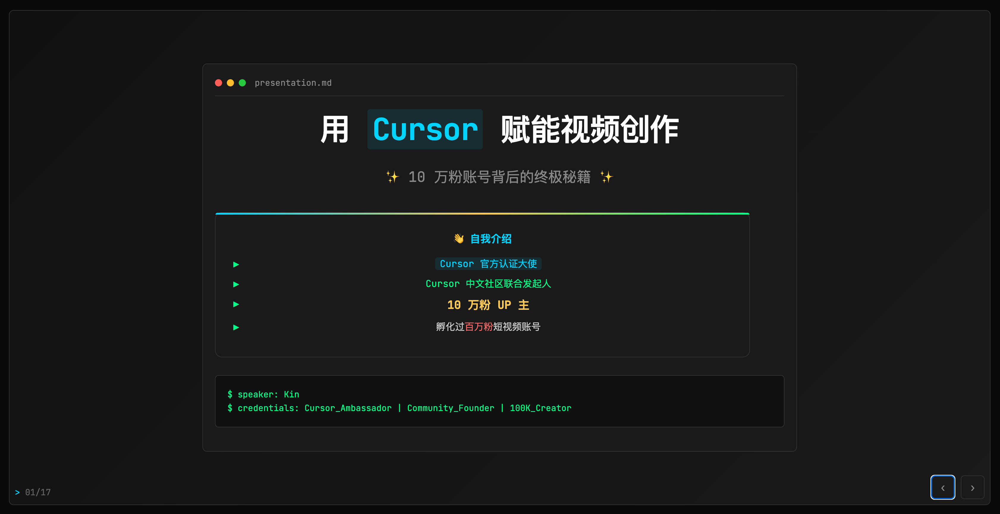
*用Cursor赋能视频创作 - 北京Meetup现场演示*

### 核心观点展示
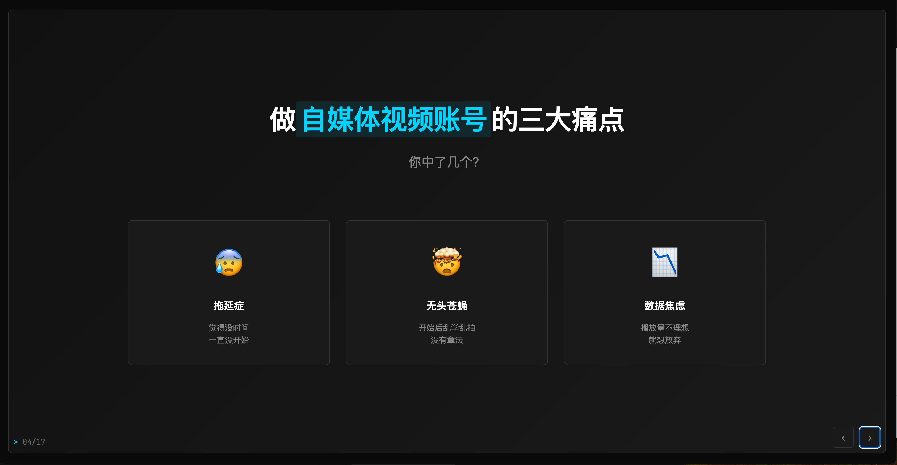
*分析做自媒体视频账号的三大痛点*

### 解决方案流程
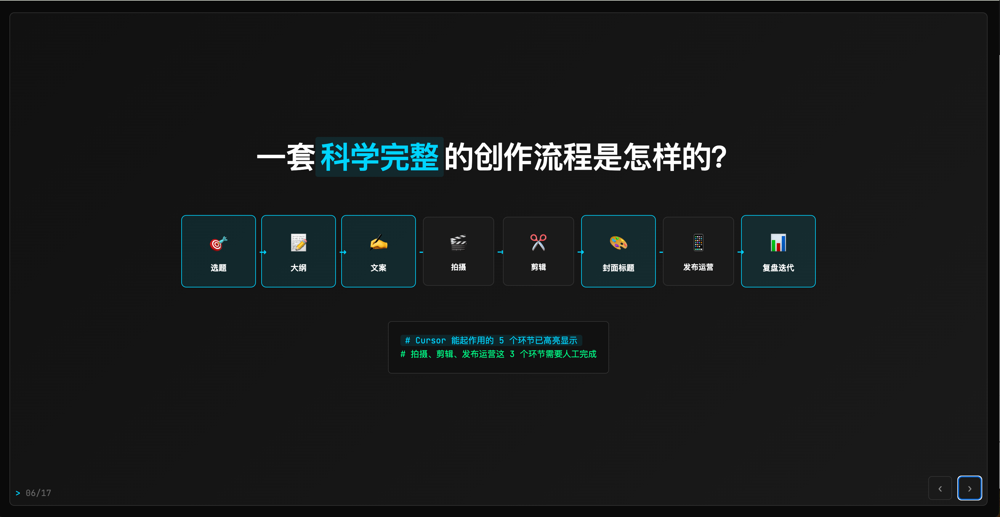
*展示科学完整的创作流程*

### 实战应用场景
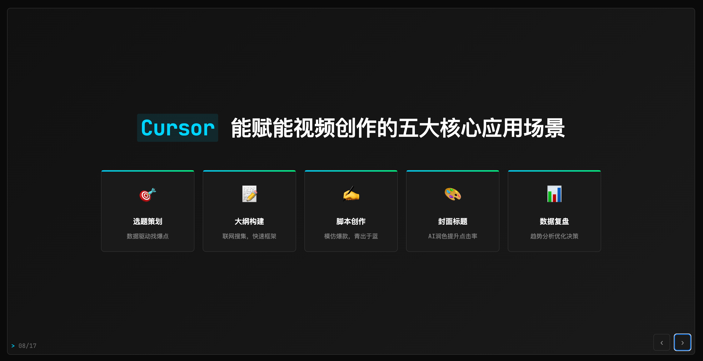
*Cursor能赋能视频创作的五大核心应用场景*

### 📊 完整页面列表

<details>
<summary>📋 点击展开查看所有17页截图</summary>

|  |
|:---:|
| **第1页** - [slide-01.png](screenshots/slides/slide-01.png) |

| 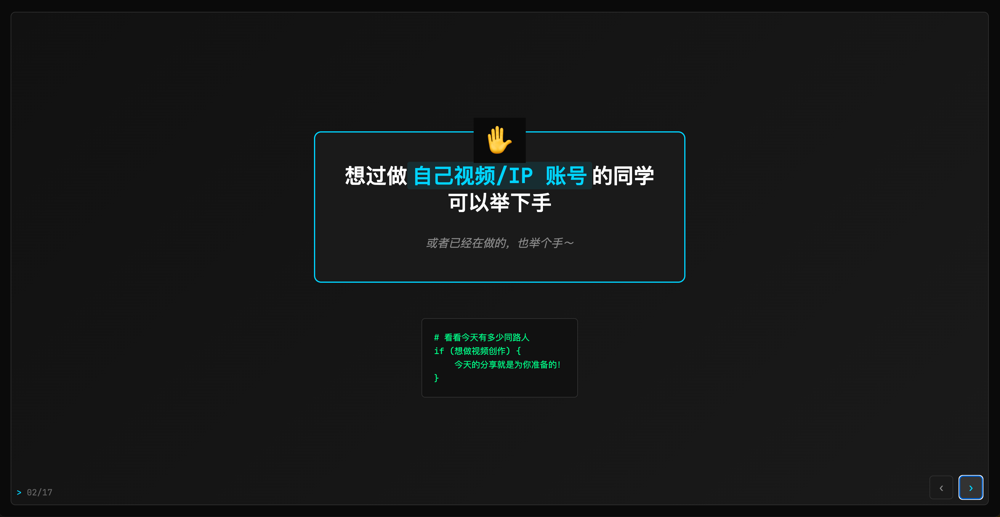 |
|:---:|
| **第2页** - [slide-02.png](screenshots/slides/slide-02.png) |

| 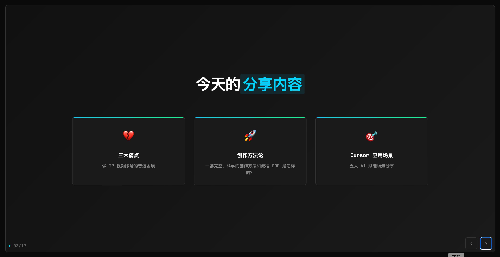 |
|:---:|
| **第3页** - [slide-03.png](screenshots/slides/slide-03.png) |

|  |
|:---:|
| **第4页** - [slide-04.png](screenshots/slides/slide-04.png) |

| 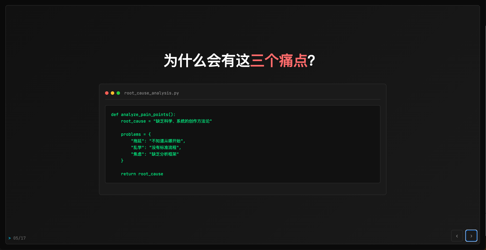 |
|:---:|
| **第5页** - [slide-05.png](screenshots/slides/slide-05.png) |

|  |
|:---:|
| **第6页** - [slide-06.png](screenshots/slides/slide-06.png) |

| 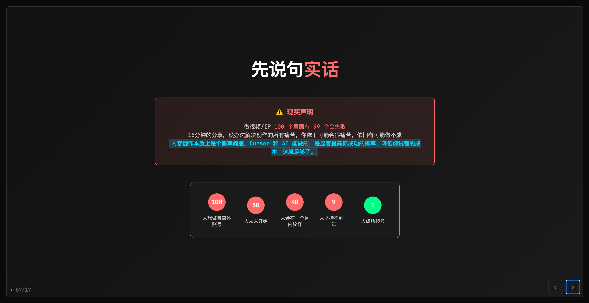 |
|:---:|
| **第7页** - [slide-07.png](screenshots/slides/slide-07.png) |

|  |
|:---:|
| **第8页** - [slide-08.png](screenshots/slides/slide-08.png) |

| 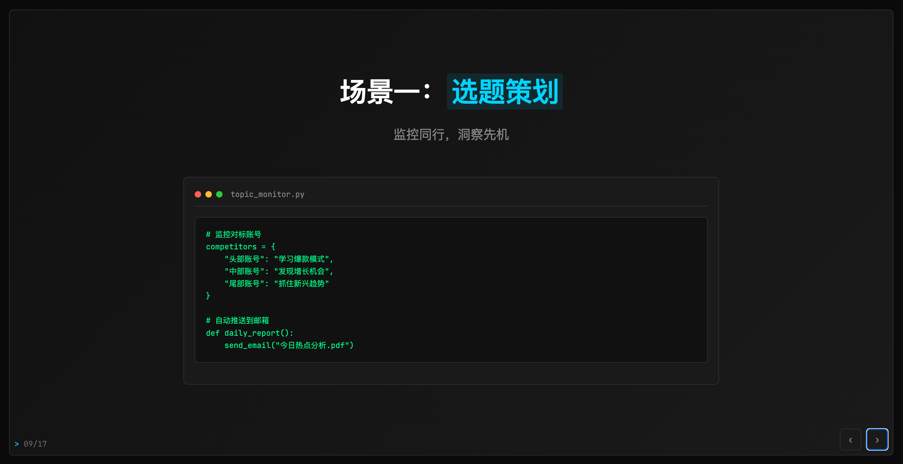 |
|:---:|
| **第9页** - [slide-09.png](screenshots/slides/slide-09.png) |

| 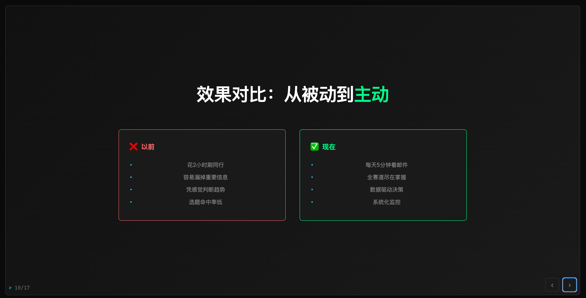 |
|:---:|
| **第10页** - [slide-10.png](screenshots/slides/slide-10.png) |

| 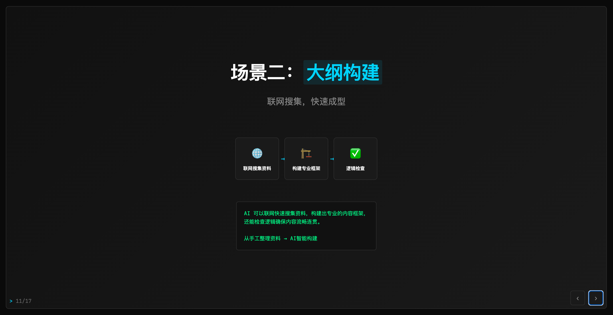 |
|:---:|
| **第11页** - [slide-11.png](screenshots/slides/slide-11.png) |

| 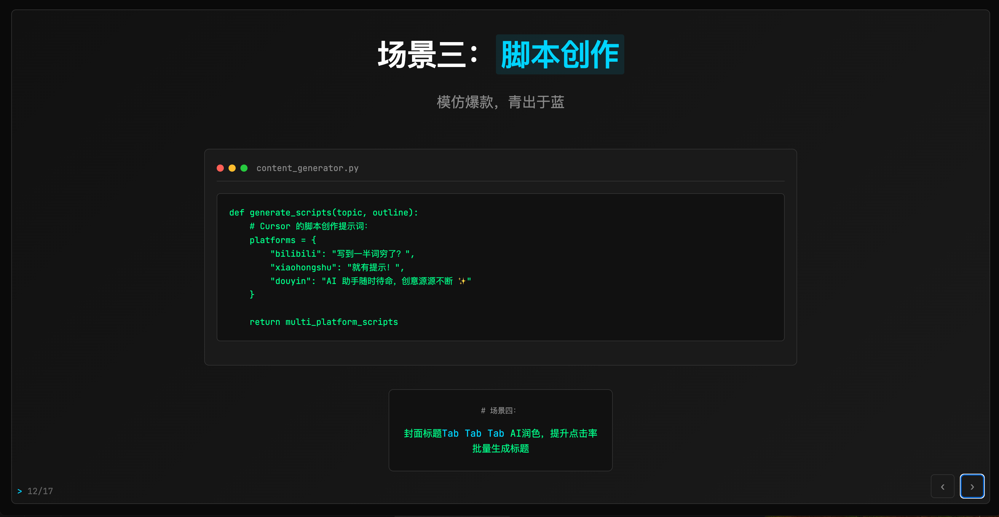 |
|:---:|
| **第12页** - [slide-12.png](screenshots/slides/slide-12.png) |

| 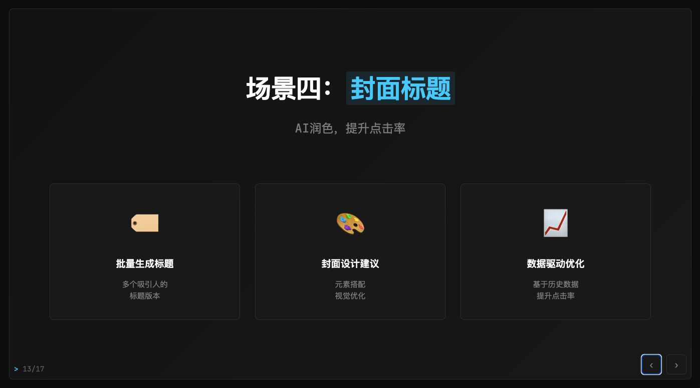 |
|:---:|
| **第13页** - [slide-13.png](screenshots/slides/slide-13.png) |

| 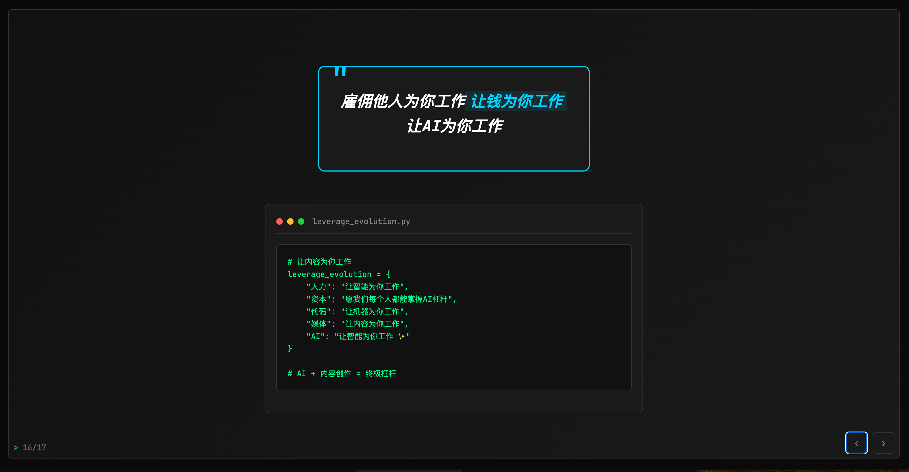 |
|:---:|
| **第14页** - [slide-14.png](screenshots/slides/slide-14.png) |

| 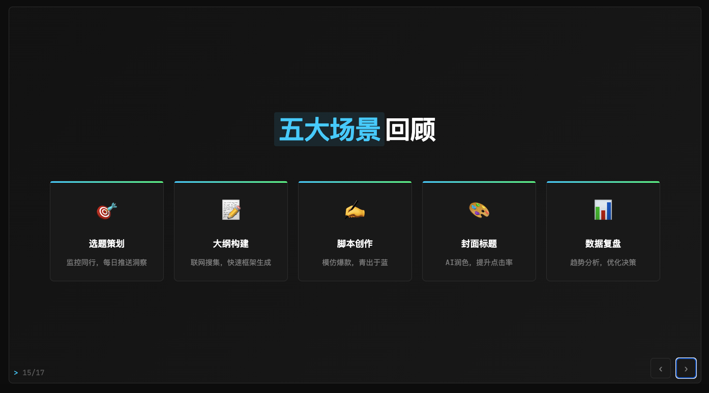 |
|:---:|
| **第15页** - [slide-15.png](screenshots/slides/slide-15.png) |

| 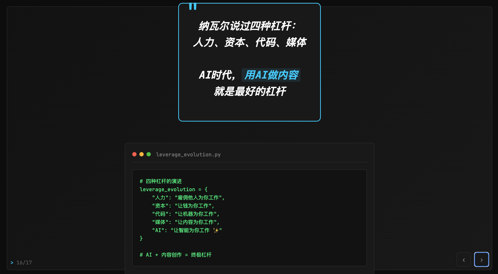 |
|:---:|
| **第16页** - [slide-16.png](screenshots/slides/slide-16.png) |

| 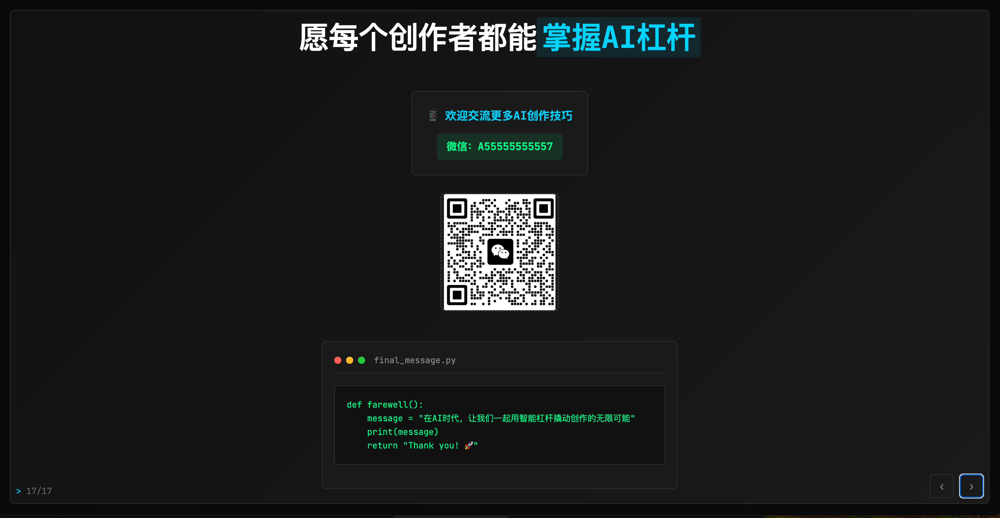 |
|:---:|
| **第17页** - [slide-17.png](screenshots/slides/slide-17.png) |

</details>

> 💡 **提示**: 点击图片可以查看高清版本。所有截图都采用1920x1080分辨率，完美展示了Cursor制作PPT的专业效果。

### 🎯 如何更新截图？

如果您修改了PPT内容，可以：
1. 运行 `capture-slides.js` 重新生成截图
2. 运行 `node update-readme-with-screenshots.js` 更新README
3. 提交更改：`git add . && git commit -m "📸 更新PPT截图" && git push`


## 🚀 快速开始

### 直接使用
1. 克隆或下载项目
2. 双击 `cursor-ppt-presentation.html` 文件
3. 在浏览器中打开即可开始使用

### 在线预览
```bash
# 如果有本地服务器
python -m http.server 8000
# 或者
npx serve .
```

## 📖 使用指南

### 基本操作
- 用键盘左右箭头键或点击右下角按钮切换页面
- 按空格键可以快速翻到下一页
- 按 `Shift + 空格` 可以把当前页放大居中显示

### 编辑内容
- 按 `Cmd/Ctrl + I` 显示编辑工具
- 点击 "📝 编辑模式" 开始编辑
- 看到蓝色高亮的文字都可以直接点击修改
- 不想要的内容可以删除（鼠标移上去会显示 × 按钮）

### 更换图片
- 按 `Cmd/Ctrl + Shift + I` 可以插入新图片
- 在编辑模式下点击现有图片可以替换
- 支持常见的图片格式（JPG、PNG、GIF等）

### 演示功能
- 按 `Cmd/Ctrl + K` 显示更多功能选项
- 按 `F11` 进入全屏演示模式
- 按 `Cmd/Ctrl + S` 手动保存你的修改
- 按 `ESC` 关闭弹出的窗口

## 🎯 项目结构

```
cursor-ppt-presentation/
├── cursor-ppt-presentation.html    # 🚀 主文件 - 北京Meetup现场演示的完整实现
├── README.md                       # 📖 项目说明 - 展示Cursor制作PPT的强大能力
├── LICENSE                         # 📜 MIT开源许可证
├── CHANGELOG.md                    # 📝 版本记录 - 记录Cursor开发历程
├── CONTRIBUTING.md                 # 🤝 贡献指南 - 欢迎更多Cursor创作案例
├── package.json                    # 📦 项目配置
├── capture-slides.js               # 📸 自动截图脚本 - 批量生成PPT页面截图
├── update-readme-with-screenshots.js # 🔄 README更新脚本 - 自动添加截图预览
├── .github/                        # 🐛 GitHub配置
│   └── ISSUE_TEMPLATE/
└── screenshots/                    # 📸 演示资源
    ├── README.md                   # 截图说明文档
    └── slides/                     # PPT页面截图集合
        ├── README.md               # 截图使用指南
        ├── slide-01.png            # 第1页：开场
        ├── slide-02.png            # 第2页：互动问题
        ├── ...                     # 更多页面截图
        └── slide-17.png            # 第17页：联系方式
```

## 🛠️ 实现方式

- **网页技术** - 用网页形式实现，比传统PPT更灵活
- **现代样式** - 炫酷的视觉效果和流畅的动画
- **交互功能** - 点击、编辑、上传等丰富的互动体验
- **本地存储** - 自动保存到浏览器，数据永不丢失
- **图片处理** - 智能处理图片上传和显示

## 📋 功能列表

### 演示功能
- [x] 幻灯片切换动画
- [x] 键盘导航支持
- [x] 全屏演示模式
- [x] 居中显示功能
- [x] 响应式布局

### 编辑功能
- [x] 实时文本编辑
- [x] 图片插入和替换
- [x] 模块删除功能
- [x] 自动保存机制
- [x] 内容导出功能

### 用户体验
- [x] 丰富的键盘快捷键
- [x] 视觉反馈和动画
- [x] 编辑模式指示
- [x] 本地存储恢复

## 🎨 个性化定制

### 更换配色方案
想要不同的颜色？可以轻松修改：
- 主色调 - 目前是科技蓝
- 强调色 - 目前是荧光绿  
- 警告色 - 目前是红色
- 背景色 - 目前是深黑色

### 添加新内容页
1. 复制现有页面的结构
2. 修改成你想要的内容
3. 更新页码就完成了

### 调整视觉样式
这个PPT的每个部分都可以自定义：
- 幻灯片整体布局
- 科技感边框样式
- 终端窗口外观
- 高亮文字效果

## 🤝 贡献指南

欢迎贡献代码！请遵循以下步骤：

1. Fork 这个项目
2. 创建新的功能分支 (`git checkout -b feature/AmazingFeature`)
3. 提交你的更改 (`git commit -m 'Add some AmazingFeature'`)
4. 推送到分支 (`git push origin feature/AmazingFeature`)
5. 开启一个 Pull Request

## 📜 许可证

本项目采用 MIT 许可证 - 查看 [LICENSE](LICENSE) 文件了解详情

## 🙏 致谢

- 感谢 [Cursor](https://cursor.sh) 提供的强大AI编程工具
- 感谢 [JetBrains Mono](https://www.jetbrains.com/lp/mono/) 提供的优秀等宽字体
- 感谢所有为开源社区做出贡献的开发者

## 📞 联系方式

想了解更多 Cursor 在内容创作中的应用？

- 💬 **微信**：A55555555557
- 🎯 **身份**：Cursor 官方认证大使 & 10万粉UP主
- 📧 **合作咨询**：Cursor 企业培训、AI 创作工作坊
- 🔗 **项目地址**：[GitHub Repository](https://github.com/KinGao294/cursor-meetup-ppt-202506)
- 🐛 **问题反馈**：[Issues](https://github.com/KinGao294/cursor-meetup-ppt-202506/issues)


---

**🚀 Made with Cursor** by [Kin] - *让 AI 成为你的创作伙伴* 